Spring Authenatication - Employee Password Login
===
[top]: topOfThePage

Hello Ganesh, 

This is a step-by-step pages on Creating Spring Authenticate for your project, check out if it is helpful. 

:)

| step | Branch | Change Description | img |
| ---: | --- | --- | --- |
|  01 | [ver00](https://github.com/alvintwng/steps/tree/ver00/AuthEmp) | [ Creating Database Connection  ](    https://github.com/alvintwng/steps/commit/bdab77032b18bc4ae186b84df19c15f730025acf ) | 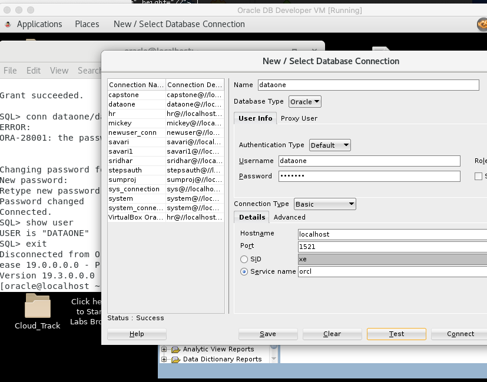 |
|  02 | [ver01](https://github.com/alvintwng/steps/tree/ver01/AuthEmp) | [ Init with Pojo, Employee, Role  ](    https://github.com/alvintwng/steps/commit/5cb3ffe2a7a00a75d9f151be4b3e7fd15b1d3173 ) | 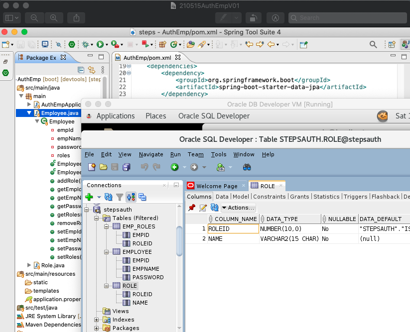 |
|  03 | [ver02](https://github.com/alvintwng/steps/tree/ver02/AuthEmp) | [ Create New Role ](                    https://github.com/alvintwng/steps/commit/61a1e93be285a1fabf8c30c592a5eadd93010335) | 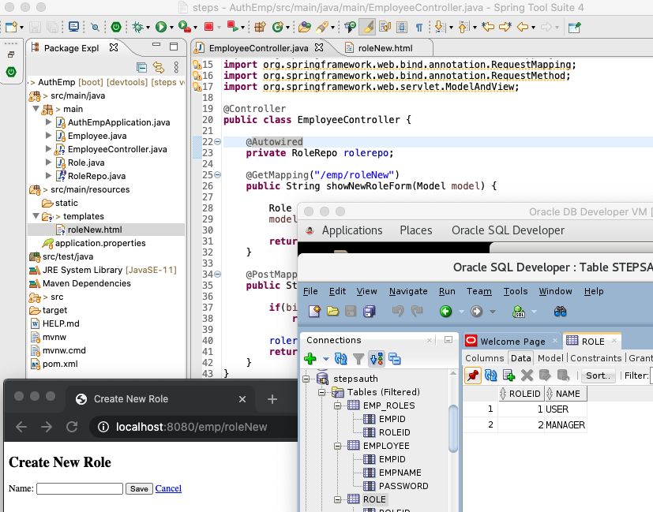 |
|  04 | [ver03](https://github.com/alvintwng/steps/tree/ver03/AuthEmp) | [ Dao, Create New Employee ](           https://github.com/alvintwng/steps/commit/c94f807c13383f6af5d54e323e3d089a69b18341)          | 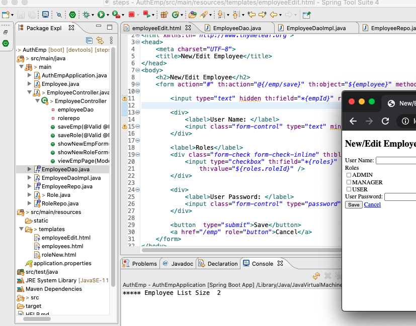 |
|  05 | [ver04](https://github.com/alvintwng/steps/tree/ver04/AuthEmp) | [ Edit, Delete Employee ](              https://github.com/alvintwng/steps/commit/c83a6a01b092339bb51c4483a1c284980270f740)          | 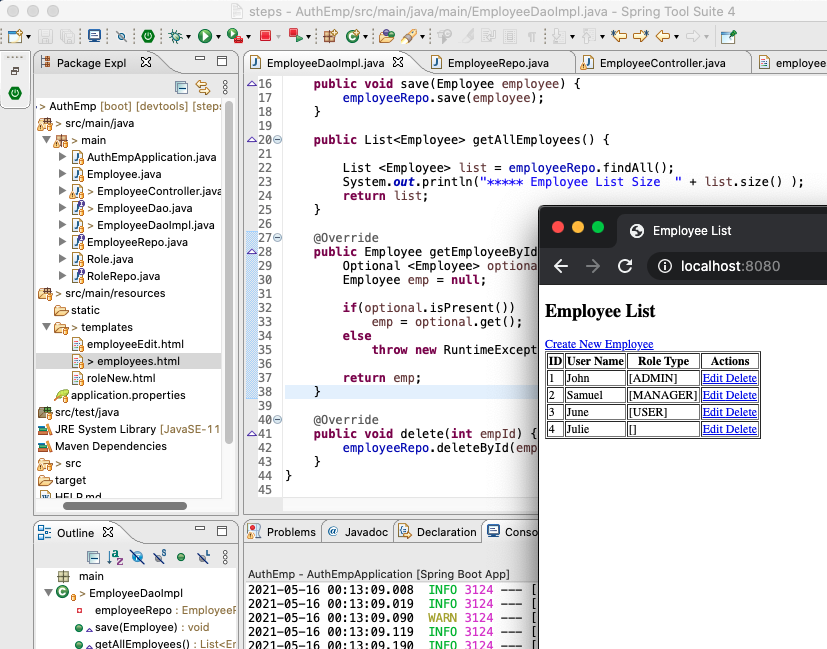 |
|  06 | [ver05](https://github.com/alvintwng/steps/tree/ver05/AuthEmp) | [ Spring Boot Starter Security ](       https://github.com/alvintwng/steps/commit/4a8e9fbae6eb41efddd7ad745318c951214cd0d5)          | 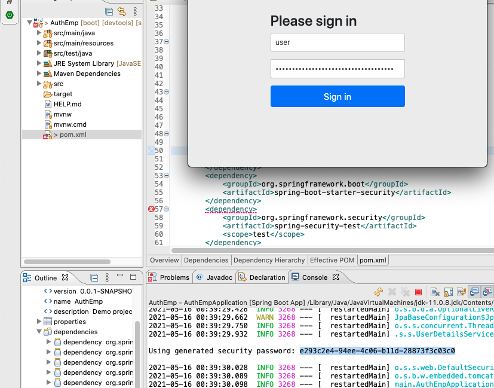 |
|  07 | [ver06](https://github.com/alvintwng/steps/tree/ver06/AuthEmp) | [ DefaultPassword, UserDetailService ]( https://github.com/alvintwng/steps/commit/56b52ac11443c4104516809a891439e13a2343b1)          | 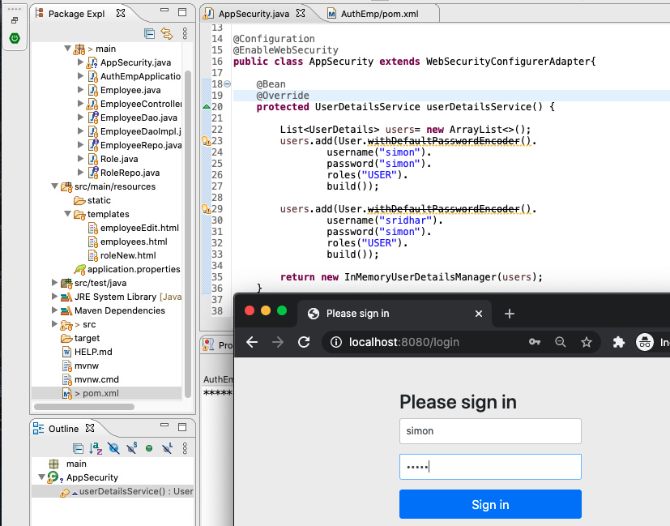 |
|  08 | [ver07](https://github.com/alvintwng/steps/tree/ver07/AuthEmp) | [ SpringAuth, UserDetailServiceImpl ](  https://github.com/alvintwng/steps/commit/b78f5328a44ccec6235ed3e6b77770f70c08172d)          | 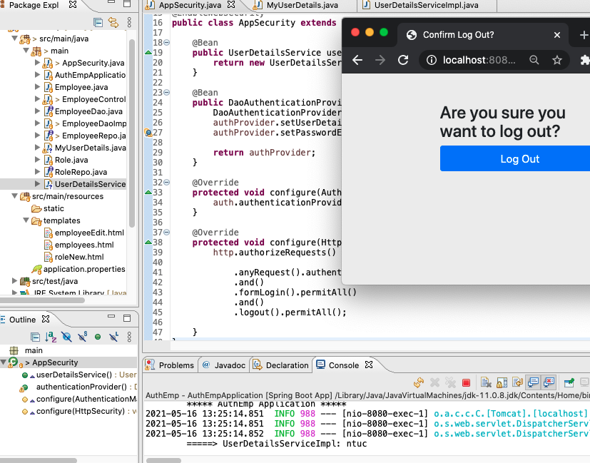 |
|  09 | [ver08](https://github.com/alvintwng/steps/tree/ver08/AuthEmp) | [ BCryptPassword ](                     https://github.com/alvintwng/steps/commit/619013b5f64a6643d3780be3e3b700b11dff832b)          | 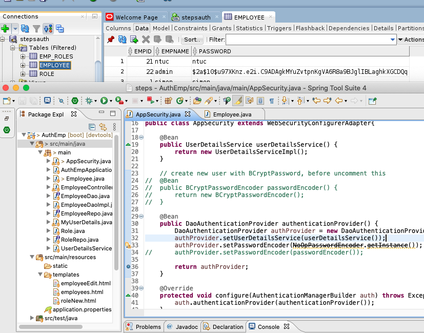 |
|  10 | [ver09](https://github.com/alvintwng/steps/tree/ver09/AuthEmp) | [ sec:authorize, antMatchers ](         https://github.com/alvintwng/steps/commit/f0f1ca588f2e37e6e623679c400d4dafa281a22b)          | 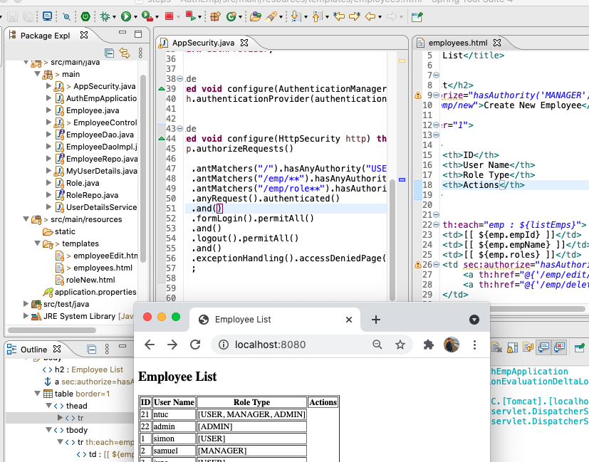 |
|  11 | [ver10](https://github.com/alvintwng/steps/tree/ver10/AuthEmp) | [ Login Page ](         https://github.com/alvintwng/steps/commit/92bc6571d9a5aa63329991a235137dbd77f9aeb2)          | 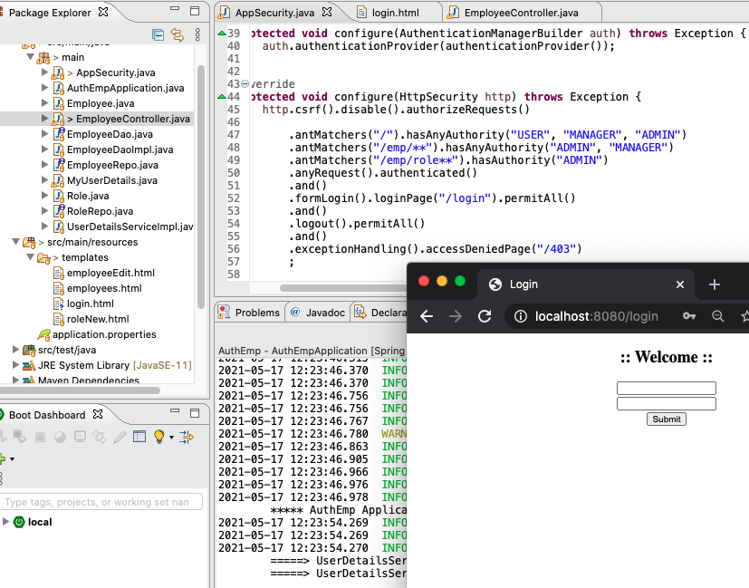 |
|  12 | [ver11](https://github.com/alvintwng/steps/tree/ver11/AuthEmp) | [ Logout Page ](         https://github.com/alvintwng/steps/commit/61d9370784ff3aed52b95ade6b3b8fb4c85fb4bc)          | 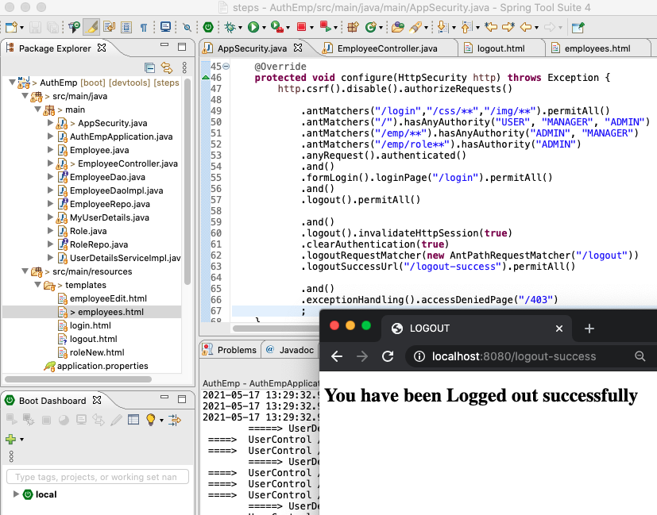 |

[:top: Top](#top)

---
