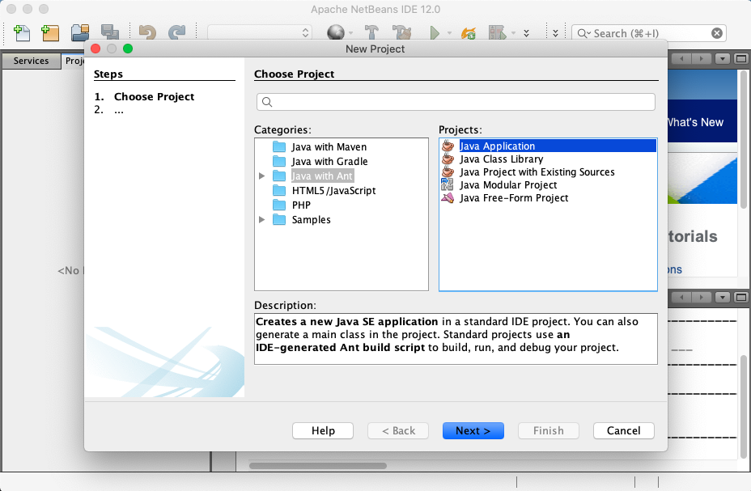
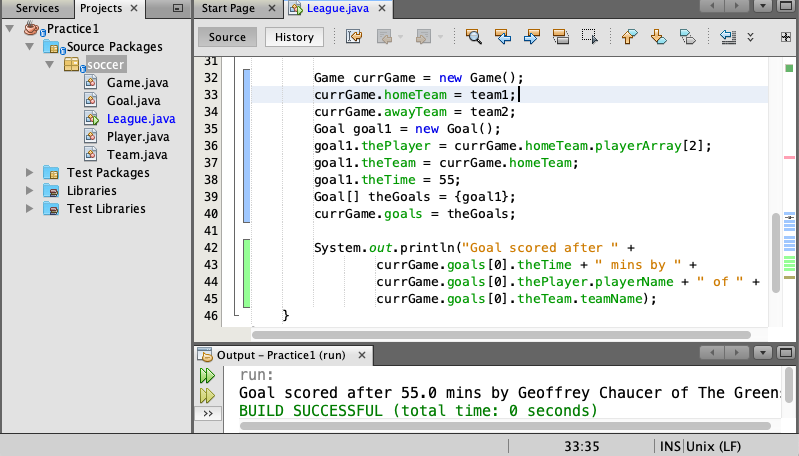
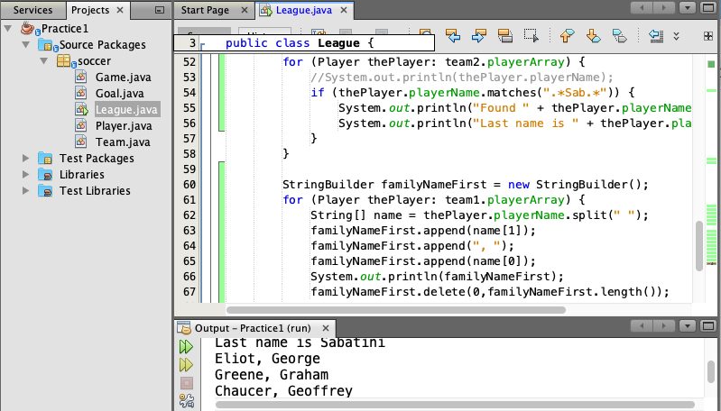
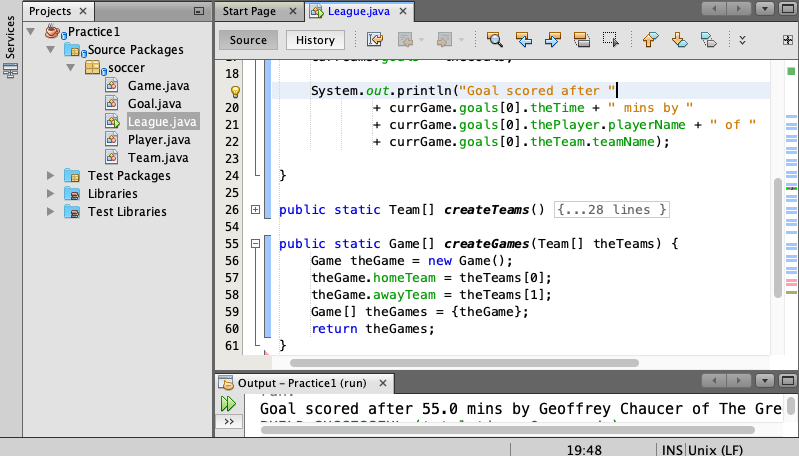
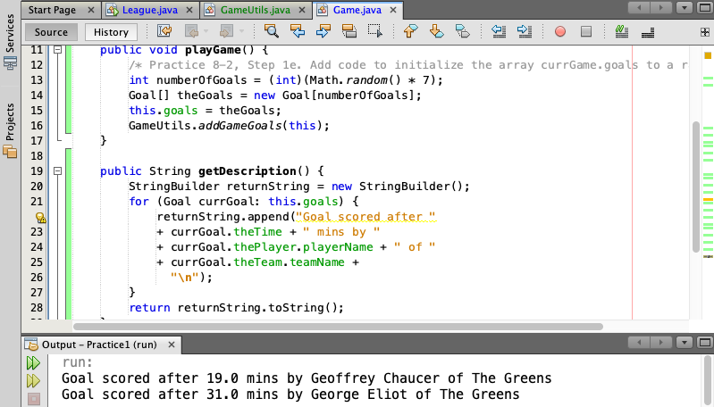

Soccer
===
[top]: topOfThePage

| step | Branch | Change Description | img |
| ---: | --- | --- | --- |
| 01 | 	[pr101](	https://github.com/alvintwng/steps/tree/pr101/Practice1 )| 	[create new project](	https://github.com/alvintwng/steps/commit/049ae569123e914c65300fc557218cc3d715406b)| 	 |
| 02 | 	[pr102](	https://github.com/alvintwng/steps/tree/pr102/Practice1)| 	[Creating Classes](	https://github.com/alvintwng/steps/commit/a6fb11c98ecd51ae125feb115aff993ff6083cad )| 	 |
| 03 | 	[pr103](	https://github.com/alvintwng/steps/tree/pr103/Practice1)| 	[Create a game	](	https://github.com/alvintwng/steps/commit/267a8d26d33ba4869047b983f1e26dff93510682)| 	 |
| 04 | 	[pr104](	https://github.com/alvintwng/steps/tree/pr104/Practice1)| 	[Matches, Split, Append](	https://github.com/alvintwng/steps/commit/1f26b476594094a189aeb239f5d23f2baf1a5fea)| 	 |
| 05 | 	[pr105](	https://github.com/alvintwng/steps/tree/pr105/Practice1)| 	[Using Methods](	https://github.com/alvintwng/steps/commit/913166b7c21e755afe21a3c033f4fac2c07a0adc)| 	 |
| 06 | 	[pr106](	https://github.com/alvintwng/steps/tree/pr106/Practice1)| 	[Create Random Data](	https://github.com/alvintwng/steps/commit/1a98f0ce60e4c0a3782e994dfc41088588c780f9)| 	 |
| 01 | 	| 	| 	 |

[:top: Top](#top)

---
