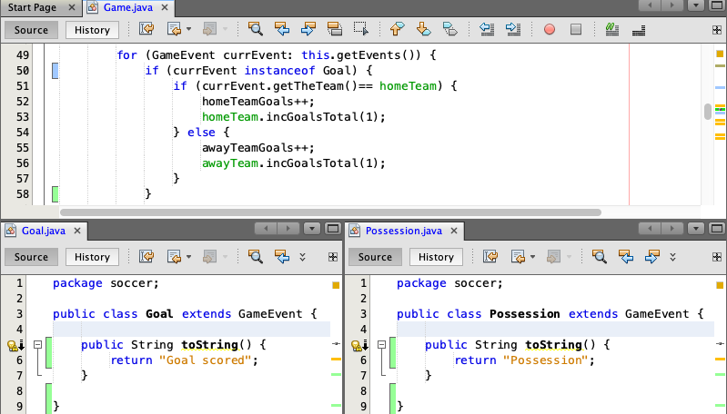

Java SE I : Programming. Practice1 -  Soccer
===
[top]: topOfThePage

| step | Branch | Change Description | img |
| ---: | --- | --- | --- |
| 01 | 	[pr101](	/../../tree/pr101/Practice1 )| 	[create new project](	/../../commit/049ae569123e914c65300fc557218cc3d715406b)| 	 |
| 02 | 	[pr102](	/../../tree/pr102/Practice1)| 	[Creating Classes](	/../../commit/a6fb11c98ecd51ae125feb115aff993ff6083cad )| 	 |
| 03 | 	[pr103](	/../../tree/pr103/Practice1)| 	[Create a game	](	/../../commit/267a8d26d33ba4869047b983f1e26dff93510682)| 	 |
| 04 | 	[pr104](	/../../tree/pr104/Practice1)| 	[Matches, Split, Append](	/../../commit/1f26b476594094a189aeb239f5d23f2baf1a5fea)| 	 |
| 05 | 	[pr105](	/../../tree/pr105/Practice1)| 	[Using Methods](	/../../commit/913166b7c21e755afe21a3c033f4fac2c07a0adc)| 	 |
| 06 | 	[pr106](	/../../tree/pr106/Practice1)| 	[Create Random Data](	/../../commit/1a98f0ce60e4c0a3782e994dfc41088588c780f9)| 	 |
| 07 | 	[pr107](	/../../tree/pr107/Practice1)| 	[Overloaded Methods](	/../../commit/b4ffea4e87b92dcca0f29eac20a58c0d3d9cdfa5)| 	 |
| 08 | 	[pr108](	/../../tree/pr108/Practice1)| 	[Encapsulating. Getters, Setters](	/../../commit/27c7a302718ee1703357a3b1a2d72bf8732e7089)| 	 |
| 09 | 	[pr109](	/../../tree/pr109/Practice1)| 	[Adding Constructors	](	/../../commit/92c911ecb486e0c6a8ccaea2a022d85622e57328)| 	 |
| 10 | 	[pr110](	/../../tree/pr110/Practice1)| 	[Using Conditionals](	/../../commit/e2eeb2e5e125080a50a2fdbbfe04c4df45d48cd7)| 	 |
| 11 | 	[pr111](	/../../tree/pr111/Practice1)| 	[Debugging](	/../../commit/1203691c57586aec942513a5d07cb4bc20e84d83)| 	 |
| 12 | 	[pr112](	/../../tree/pr112/Practice1)| 	[ArrayList iterate thru Data	](	/../../commit/b9d3ac7814f0811ec96f0a2229eb5dbb46a4d8d7)| 	 |
| 13 | 	[pr113](	/../../tree/pr113/Practice1)| 	[LocalDateTime, Period](	/../../commit/ec6f013555b9eafb32bc5423567ff11decad2593)| 	 |
| 14 | 	[pr114](	/../../tree/pr114/Practice1)| 	[ArrayList, toArray](	/../../commit/7d0ecbe21a675b2aad98f6974fe594fb5577baea)| 	 |
| 15 | 	[pr115](	/../../tree/pr115/Practice1)| 	[Using Inheritance. Abstract, Extends	](	/../../commit/1aca177ac335aabeb52a86c25011dcdeb82220b8)| 	 |
| 16 | 	[pr116](	/../../tree/pr116/Practice1)| 	[Polymorphism. Instanceof](	/../../commit/3068e0bccd013ff02815f26a1197e6470c9e3405)| 	 |
| 17 | 	[pr117](	/../../tree/pr117/Practice1)| 	[Interface. Implements](	/../../commit/13584954a5b652dd6d4dfa9e9b854827b960c6ad)| 	 |
| 18 | 	[pr118](	/../../tree/pr118/Practice1)| 	[Lambda Exp for Sorting](	/../../commit/dad0955708481bb5ad1373cef89d1ea72f080763)| 	 |
| 19 | 	[pr119](	/../../tree/pr119/Practice1)| 	[Handling Exception](	/../../commit/bb3499acddb1e8da74791d8fe71036cc55803f56)| 	 |
  | 20 | 	[pr120](	/../../tree/pr120/Practice1)| No comments | 	 |
| 21 | 	[pr121](	/../../tree/pr121/Practice1)| 	[sample console output](/../../blob/pr121/Practice1/sampleOutput.md)| 	 |

[:top: Top](#top)

---
